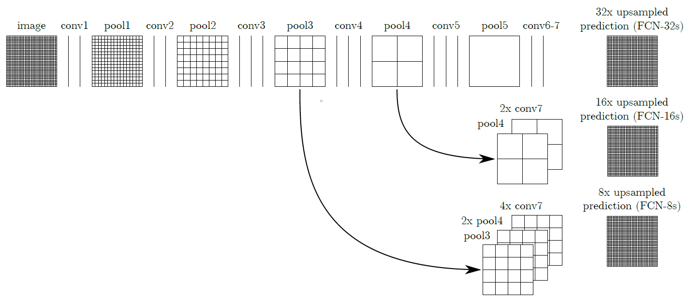
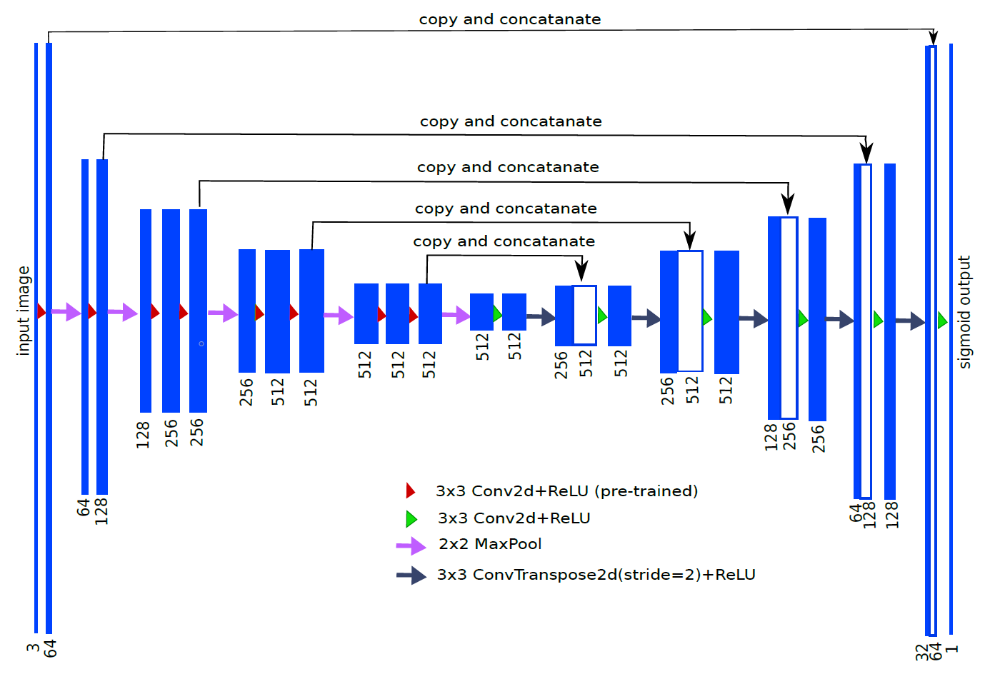

# Semantic segmentation

Implementation of X end-to-end semantic segmentation methods:

- [FCN-8](https://arxiv.org/abs/1411.4038).
- [U-Net](https://arxiv.org/abs/1505.04597).

They are trained on PASCAL VOC 2012, which can be found [here](https://pjreddie.com/projects/pascal-voc-dataset-mirror/).

## FCN-8 Architecture

## U-Net Architecture

- Note that since I use a pre-trained VGG-net as the encoder, the network is more like the [TernausNet](https://arxiv.org/abs/1801.05746).

